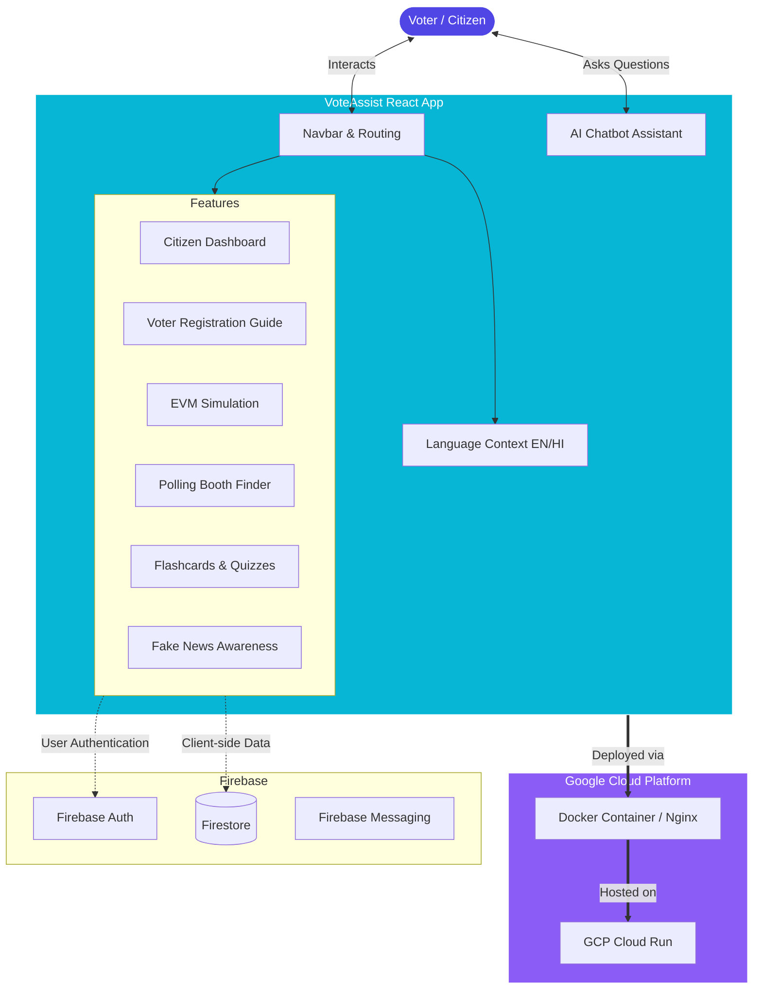

# 🗳️ VoteAssist: AI-Powered Election Assistant

VoteAssist is a modern, gamified, and highly interactive web application designed to help Indian citizens navigate the electoral process with confidence. It serves as a comprehensive guide for voter registration, polling booth location, and understanding the voting process, all while combating misinformation.

---

## 🌟 Key Features

- **Interactive Citizen Dashboard**: A personalized portal featuring a digital Elector's Photo Identity Card (EPIC), upcoming election countdowns, and application tracking.
- **EVM Voting Simulation**: Experience the exact voting procedure using a virtual Electronic Voting Machine (EVM).
- **AI-Powered Chatbot**: Get instant answers about eligibility, Form 6 registration, and polling booth details through our context-aware keyword matching assistant.
- **Gamified Learning**: Engage with flashcards and quizzes to learn about the Indian Constitution and Election Commission of India.
- **Multilingual Support**: Seamlessly switch between English and Hindi for maximum accessibility.
- **Fake News Shield**: Educational module teaching citizens how to spot and verify misinformation circulating on WhatsApp and social media.
- **Polling Booth Finder**: Locate your exact polling station and Booth Level Officer (BLO) details using your EPIC number.

---

## 🏗️ Architecture & Flow Diagram

The application is built on a modern React SPA architecture with a responsive, glassmorphism UI powered by Tailwind CSS v4.



---

## 💻 Technology Stack

- **Frontend Framework**: React 19 + Vite
- **Styling**: Tailwind CSS v4 (with custom glassmorphism variants)
- **Animations**: Framer Motion
- **Icons**: Lucide React
- **Routing**: React Router DOM v7
- **Backend / BaaS**: Firebase (Firestore, Auth, Messaging)
- **Deployment & Hosting**: Google Cloud Run + Docker + Nginx

---

## 🚀 Local Setup Instructions

1. **Clone the repository:**
   ```bash
   git clone https://github.com/Tsrinivas123/VoteAssist.git
   cd VoteAssist
   ```

2. **Install dependencies:**
   ```bash
   npm install
   ```

3. **Configure Firebase:**
   Open `src/firebase.js` and replace the placeholder configuration with your active Firebase project credentials.

4. **Start the development server:**
   ```bash
   npm run dev
   ```
   The application will be available at `http://localhost:5173`.

---

## ☁️ Deployment (Google Cloud Run)

This repository includes a multi-stage `Dockerfile` and an `nginx.conf` designed for Cloud Run. 

To deploy directly to your Google Cloud Project:
```bash
# Authenticate
gcloud auth login
gcloud config set project YOUR_PROJECT_ID

# Deploy
gcloud run deploy vote-assist \
  --source . \
  --region us-central1 \
  --allow-unauthenticated
```
