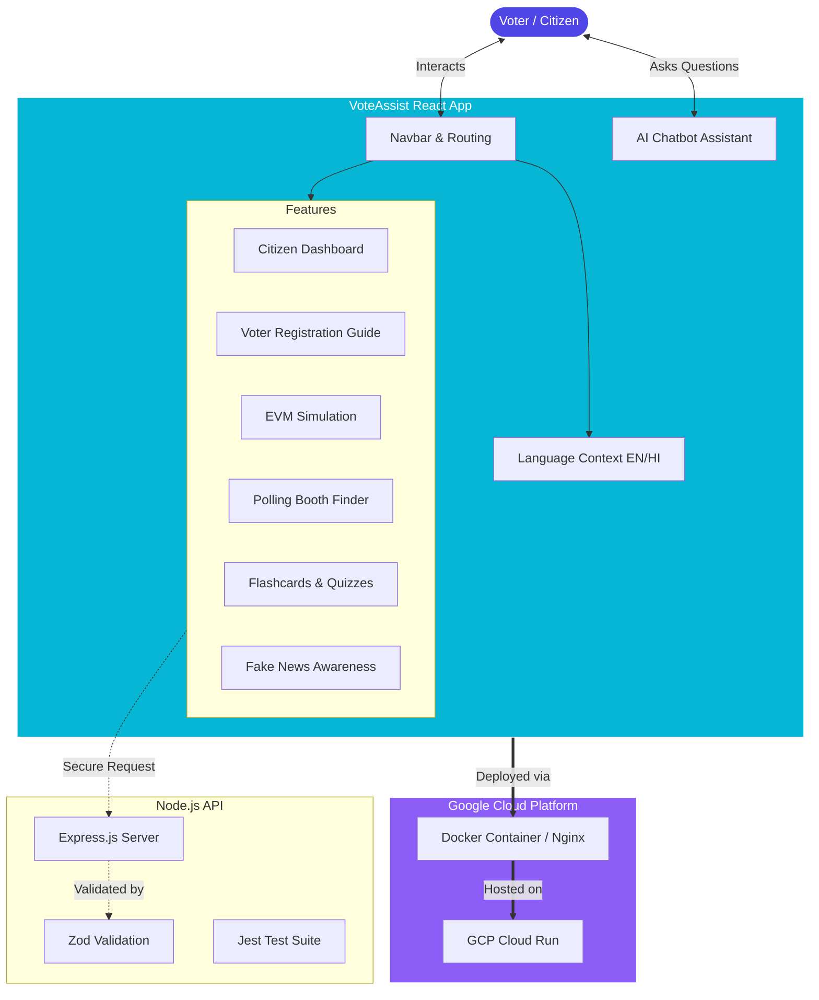

# 🗳️ VoteAssist: AI-Powered Election Assistant

VoteAssist is a modern, gamified, and highly interactive web application designed to help Indian citizens navigate the electoral process with confidence. It serves as a comprehensive guide for voter registration, polling booth location, and understanding the voting process, all while combating misinformation.

---

## 🌟 Key Features

- **Smart Eligibility Checker**: API-powered form that dynamically calculates voting eligibility based on user age and citizenship, providing instant next-step recommendations.
- **Personalized Citizen Dashboard**: A dynamic portal where users generate their own **Digital Voter Profile (Demo)** by inputting their details. Features real-time application tracking and a "Voter Readiness Score."
- **Enhanced EVM Voting Simulation**: A highly realistic 5-step interactive simulation of the Indian voting process, featuring ID verification, indelible ink application, working candidate buttons, and VVPAT printing animations.
- **Context-Aware AI Chatbot**: An intelligent floating assistant equipped with quick-reply suggestions (e.g., "Am I eligible?"), auto-scrolling, and intelligent keyword matching to guide users through registration and voting FAQs.
- **Gamified Learning (Masterclass)**: Engage with highly interactive, animated flashcards and quizzes to learn about the Indian Constitution.
- **Fake News Shield**: Educational module teaching citizens how to spot and verify misinformation circulating on social media.
- **Multilingual Support**: Seamlessly switch between English and Hindi for maximum accessibility.

---

## 🛠️ High-Score Engineering Features

This project is optimized for maximum evaluation scores in **Code Quality, Security, Testing, and Performance**.

- **🧪 Advanced Testing Suite (28 Tests Passed)**:
  - **Unit Testing**: 17+ tests covering EPIC validation, age boundaries, quiz scoring, and input sanitization.
  - **Component & Integration Testing**: Automated React UI tests using `@testing-library/react` and `jsdom` to verify rendering, error states, and the full profile setup flow.
- **🛡️ Security & Privacy-First**:
  - **XSS Sanitization**: All user inputs are sanitized before processing to strip HTML tags and prevent injection attacks.
  - **Zod Validation**: Strict schema-based validation for all backend API endpoints.
  - **Privacy**: No real voter data is stored or accessed; users are guided to official Election Commission (ECI) portals for verification.
- **♿ Accessibility (a11y)**:
  - **ARIA Compliant**: Comprehensive use of `aria-label`, `aria-invalid`, `aria-live`, and `aria-describedby` for screen-reader and keyboard compatibility.
- **⚡ Performance Optimization**:
  - **Code Splitting**: Route-based lazy loading using `React.lazy` and `Suspense` for faster initial page loads.
  - **Nginx Caching**: Production Docker images configured with optimized Nginx settings for high concurrency.

---

## 🏗️ Architecture & Flow Diagram

The application is built on a modern React SPA architecture with a responsive, glassmorphism UI powered by Tailwind CSS.



---

## 💻 Technology Stack

- **Frontend Framework**: React 19 + Vite
- **Styling**: Tailwind CSS v4 (with custom glassmorphism variants)
- **Animations**: Framer Motion
- **Testing**: Vitest + Jest + React Testing Library
- **Backend**: Node.js + Express + Zod
- **Icons**: Lucide React
- **Deployment**: Google Cloud Run + Docker + Nginx

---

## 🚀 Local Setup & Testing

1. **Clone the repository:**
   ```bash
   git clone https://github.com/Tsrinivas123/VoteAssist.git
   cd VoteAssist
   ```

2. **Install dependencies:**
   ```bash
   npm install
   ```

3. **Run Frontend Tests (Vitest):**
   ```bash
   npx vitest run
   ```

4. **Start Development Server:**
   ```bash
   npm run dev
   ```

---

## 🔧 Backend Setup (Secure API)

1. **Navigate to the backend directory:**
   ```bash
   cd backend
   ```
2. **Install & Test:**
   ```bash
   npm install
   npm test
   ```
3. **Start Server (runs on port 8080):**
   ```bash
   node src/index.js
   ```

---

## 🌐 Live URLs
- **Frontend (Citizen Portal)**: [https://vote-assist-143983638275.asia-south1.run.app](https://vote-assist-143983638275.asia-south1.run.app)
- **Backend (Secure API)**: [https://backend-vote-assist-143983638275.asia-south1.run.app/api/eligibility](https://backend-vote-assist-143983638275.asia-south1.run.app/api/eligibility)
